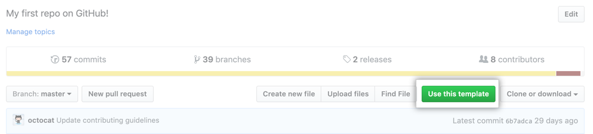

# Node.js Typescript template with ESlint and Prettier

This repository provides a scaffolding project to start Node.js project with TypeScript with ESLint and Prettier.

## Prerequisites

- [Node.js](https://nodejs.org/en/download/)
- [Yarn](https://yarnpkg.com/getting-started/install) (optional)

## Installation

**Creating a project from the `typescript-eslint-prettier-template` template**

To generate a TypeScript project that includes the dependencies and initial configuration, navigate to the [typescript-eslint-prettier-template](https://github.com/fiqrisr/typescript-eslint-prettier-template) page and click **Use this template**.

  

**Install dependencies**

Clone the generated repository on your local machine, move to the project root folder and install the dependencies defined in [`package.json`](./package.json)
```bash
$ yarn install
```

## Compiles and hot-reloads for development
```
yarn start
```

### Build for production
```
yarn build
```

### Lints and fixes files
```
yarn lint
```
